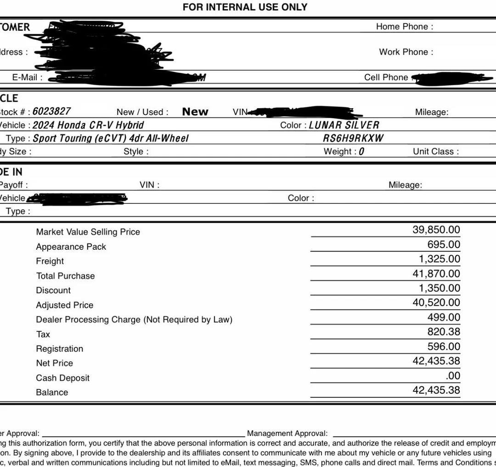

# Car Purchase Guide

New cars
--------

Tip: Do not visit the dealer before you have a written quote.

Use a fresh email for car‑related communication (dealers and insurers send lots of marketing). Proton Mail is a good option: https://proton.me/mail

Search inventory within ~50 miles for the model/trim you want.

Window Sticker (Monroney)
-------------------------

The Window Sticker is required by law and lists MSRP, destination, options, and add‑ons.

* Good: MSRP + Destination only; no dealer add‑ons.
* Acceptable: A few useful add‑ons (e.g., all‑weather mats, cargo tray).
* Bad: Lots of overpriced dealer/distributor add‑ons (paint protection, screen protectors, cables, mudguards, etc.).

Examples
--------

Good window sticker (no add‑ons)
--------------------------------

[Mazda 2025 CX‑5 2.5 S](/assets/mazda-cx5-2025-window-sticker.pdf ':ignore')

```
2025 CX‑5 2.5 S
VIN: JM3KFBAL7S0719834

MSRP:              $28,770
Destination Fee:   $ 1,495

Individual Options:

Total MSRP:        $30,265*
```

Acceptable window sticker (minimal, useful add‑ons)
--------------------------------------------------

[Subaru 2025 Crosstrek Base](/assets/subaru-crosstrek-2025-window-sticker.pdf  ':ignore')

```
Manufacturer's Suggested Retail Price $26,560.00
Exterior Color: Crystal Black Silica
Full Tank of Gas INCLD
Standard Option: 03
All-Weather Floor Liners $176.00
Cargo Tray                $145.00
Destination and Delivery $1,420.00

Total Suggested Retail Price $28,301.00
```

Bad window sticker (heavy dealer/distributor add‑ons)
----------------------------------------------------

[Toyota 2025 Corolla SE](/assets/toyota-corolla-se-2025-window-sticker.pdf  ':ignore')

```
2025 Corolla SE
VIN: 5YFSC4MCE2SP248299

MSRP:              $24,765.00
Destination Fee:   $ 1,160.00

XY900 TOYOGUARD Platinum                             $699.00
MR200 All Weather Floor Mats with All Weather Trunk  $439.00
PF100 Clear Paint Protection - Door Package          $249.00
MF Mudguards                                         $150.00
PR100 Multimedia Screen Protector                    $129.00
CY200 Phone Cable Charge Package                      $79.00
CN100 Cargo Net                                       $59.00

Total Distributor's Options                        $1,804.00

Total MSRP:                                        $27,729.00
```

Out‑the‑Door (OTD) price
------------------------

OTD includes everything you actually pay when you leave Finance: MSRP, options, destination, taxes, DMV fees, doc fee, etc.

Email template
--------------

```
Hi there,

I’d like to know the availability and Out‑the‑Door (OTD) price for a 2025 Mazda CX‑5 Select (VIN: XXXXXXXXXXXXXXXXX).

Thanks,
<Your Name>
```

If the dealer refuses to provide a written quote and insists you visit in person, move on.

Reading a quote
---------------

Common line items:
* MSRP / Adjusted Price (after discounts)
* Destination / Freight
* Doc (dealer processing) fee
* Taxes
* Registration/DMV fees
* Dealer add‑ons (often non‑negotiable — avoid if possible)

Quote examples
--------------

Quote #1
```
Balance: $42,435.38   ← Out‑the‑Door (OTD)
Appearance Pack: $695 ← Paint/color related add‑on
Freight: $1,325       ← Destination/Freight fee
Discount: –$1,350     ← Dealer/manufacturer discount
Dealer Processing Charge: paperwork/“doc” fee
Tax: sales tax
Registration: DMV/title/registration fees
```



Quote #2

* ADD'L DEALER PROFIT: $2,500 — pure dealer markup (avoid)


Insurance
---------

See [Auto Insurance](transport/auto-insurance.md). You can buy insurance online once price and VIN are confirmed.

At the dealership
-----------------

In Finance, decline add‑on packages (extended warranty, paint/tire protection, etc.) unless you specifically want them. Goal: pay the OTD price and leave.
