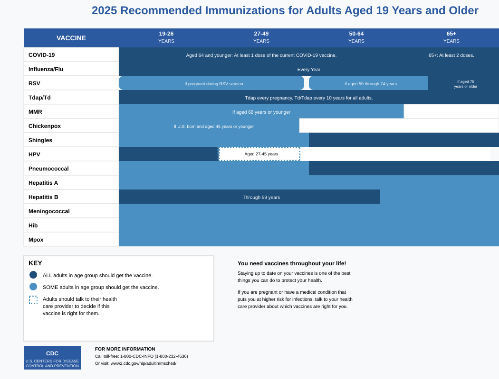

疫苗
====

在有美國健康保險的情況下，通常在 CDC ACIP 建議下的疫苗都可以施打。

CDC ACIP 建議成人疫苗
---------------------

請參考: https://www.cdc.gov/vaccines/imz-schedules/adult-easyread.html

Ref: [Adult Vaccine Schedule Chart](https://www.cdc.gov/vaccines/imz-schedules/downloads/adults-schedule-easy-read.pdf)

如何確認保險有覆蓋?
-------------------

以 NCBCBS 為例，在 [Immunization Guidelines](https://www.bluecrossnc.com/providers/policies-guidelines-codes/commercial/reimbursement/updates/immunization-guidelines) 中有提到:

:::tip

### Reimbursement Guidelines

Immunizations are reimbursed when the member certificate of coverage includes benefits for immunizations.

Unless specifically excluded by a member’s contract, Blue Cross NC will allow reimbursement for new vaccines formally recommended by Advisory Committee on Immunization Practices (ACIP) of the Centers for Disease Control and Prevention (CDC).

### Billing and Coding

| CPT® / HCPCS Code / Modifier	| Description |
| --- | --- |
| 90476-90759 | Vaccines, Toxoids |
| 90460-90474 | Vaccine administration |
| ... | ... |

:::

以 HPV 疫苗為例，CPT 為 90651，有被保險覆蓋。

Flu 流感疫苗
------------

請參考: https://flu.unc.edu/

建議每年定期施打。在學校裡面多處可以施打。

HPV-9 人類乳突病毒疫苗 (9價)
----------------------------

三劑。19-26歲建議施打，27-45建議與醫生討論後施打。

台灣每劑約台幣 3000-7000 元。
