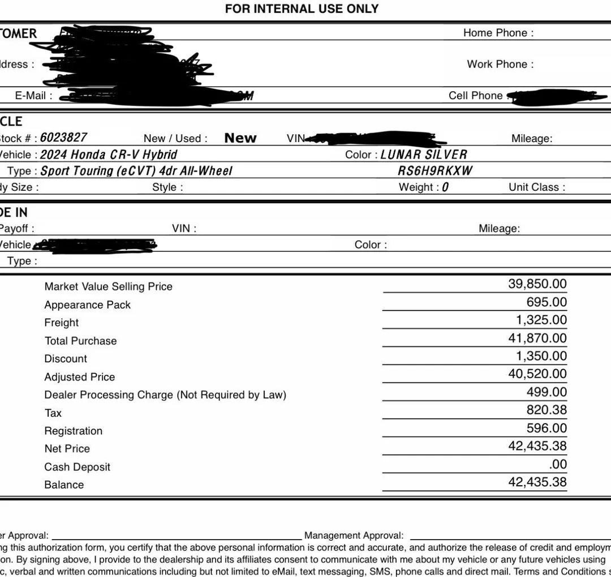

買車
====

買車前，先確認下面這三件事情:

1. 我的預算有多少
1. 我想要什麼車型 (轎車? Hatchback? SUV? Pickup?)
1. 我想要什麼車款


如何選車?
---------

強烈的建議，先到 [IIHS](https://iihs.org/) 查看安全評價:

* [IIHS Vehicle Ratings](https://www.iihs.org/ratings)
* [IIHS Top Safety Picks](https://www.iihs.org/ratings/top-safety-picks)

從這裡面選Top Safety Pick or Top Safety Pick+ 的車。


Insurance Institute for Highway Safety (IIHS) 是美國非營利組織，他們會
隨時的拿新車來做撞擊測試，並且由他們引領新的美國汽車安全標準。(新的測
試=車商必須要製作符合新規則的車款)。

* [Large SUVs struggle in IIHS tests - IIHS News](https://www.youtube.com/watch?v=E3S0Qf37b8s)

安全的車子可以讓你在車禍中安然無恙的的走出來。

買新車
-----

:::warning

不要到現場議價，除非你已經拿到報價單

:::

:::note

以下假設已經考慮好要買那一個車款

:::

買新車的目標價格是 [OTD Price](zh_TW/vehicle/car-purchase?id=什麼是-otd-price) \<\= MSRP。

### 註冊新的 email 帳號

強烈建議使用新的一組 Email 將車子與車子保險相關的專門管理。

因為車商跟保險公司很喜歡寄送垃圾信 + 可能賣你的 Email。

建議使用 [Proton Mail](https://proton.me/mail)

### 搜尋方圓 50 miles 的車商是否有想要的車款庫存


### 查看 Window Sticker

[Window Sticker](https://en.wikipedia.org/wiki/Monroney_sticker) 是聯邦法規要求新車販售時必須提供的所有資訊。在查看 Window Sticker 時，我們主要看車商有沒有在售價上加上不必要的附加物品或服務。

#### 👍👍👍 好的 Window Sticker

這是一個好的 Window Sticker，因為車價組成只有 MSRP 以及運送費 (Destination Fee)，在附加物品 (Individual Options) 上為 0 元，讚。

[Mazda 2025 CX5 2.5 S](../../static/assets/mazda-cx5-2025-window-sticker.pdf ':ignore')

```
2025 CX5 2.5 S
VIN: JM3KFBAL7S0719834

MSRP:	$ 28,770
Destination Fee:	$ 1,495

Individual Options:


Total MSRP:	$ 30,265*
```

這是一個還能接受的 Window Sticker，沒有太多廢物附加品，All-Weather Floor Liners 跟 Cargo Tray 算是有用的附加品。

[Subaru 2025 Crosstrek Base](../../static/assets/subaru-crosstrek-2025-window-sticker.pdf ':ignore')

```
Manufacturer's Suggested Retail Price $26,560.00
Exterior Color: Crystal Black Silica
Full Tank of Gas INCLD
Standard Option: 03
All-Weather Floor Liners $176.00
Cargo Tray $145.00
Destination and Delivery $1,420.00

Total Suggested Retail Price $28,301.00
```

#### 👎🙃🙄 爛透的 Window Sticker

這是一個爛透的 Window Sticker，在車價組成上除了 MSRP 以及運送費外，還附帶總價 $1804 元的垃圾。通常這些垃圾是無法議價的，車商會跟你說這些已經裝設在車上，沒有辦法拿掉。

[Toyota 2025 Corolla SE](../../static/assets/toyota-corolla-se-2025-window-sticker.pdf)

```
2025 Corolla SE
VIN: 5YFSC4MCE2SP248299

MSRP: $24,765.00
Destination Fee: $1160.00

XY900 TOYOGUARD Platinum    $699.00
MR200 All Weather Floor Mats with All Weather Trunk Mat $ 439.00
PF100 Clear Paint Protection - Door Package  $249.00
MF Mudguards  $150.00
PR100 Multimedia Screen Protector  $129.00
CY200 Phone Cable Charge Package  $79.00
CN100 Cargo Net  $59.00
Total Distributor's Options $1804.00

Total MSRP: $27,729.00
```

### 寄信問 Out the Door Price (OTD Price)

看好沒有太多垃圾的車後，透過你的新 Email 寄信去問 Out the Door Price (OTD Price)。

#### 什麼是 OTD Price

通常車價組成是這樣:

| Item | Cost |
|------|------|
| MSRP | $26500 |
| Option 1| $200 |
| Option 2| $100 |
| Destination Fee| $2000|
| Taxes | $1000 |
| DMV Fees | $150 |
| Doc Fee | $900 |

**OTD Price 就是把這些費用全部包含進來的費用**。

當你走出 Finance Office 的時候，應該就是要只付出這個價錢。

#### 如何問 OTD Price

不用廢話，直接問就好。

```
Hi there,

I would like to know the availability and OTD price of Mazda 2025 CX-5 Select (VIN: OOOOOOOOOOOOOOO).

Thanks,
<your name>
```

信寄出後，預期要拿到一張報價單。


#### 沒有拿到報價單?

如果沒有再幾封信裡面拿到報價單，或是對方希望你到現場去看車的話
，請直接無視對方，掉頭就走。

記得，沒有提供報價單的車商，沒有到現場的必要。

### 如何看報價單

#### 報價單一號



*From: https://www.reddit.com/r/whatcarshouldIbuy/comments/18zyqb5/how_does_this_quote_look/*

- Balance: $42435.38，OTD Price
- Appearance Pack: $695 這是車子本身外觀顏色的加價
- Freight: $1325 Destination Fee 的另一種寫法
- Discount: $1350 這是減價優惠的部份
- Adjusted Price: MSRP - Discount = Adj Price
- Dealer Processing Charge: 車商的手續費
- Tax: 稅
- Registration: DMV 相關費用


#### 報價單二號


*From: https://www.reddit.com/r/whatcarshouldIbuy/comments/xcrynj/2022_toyota_corolla_hybrid_this_seems_expensive/*

- **ADD'L DEALER PROFIT**: $2500，車商加價賣

### 準備汽車保險

請看 [汽車保險](zh_TW/vehicle/auto-insurance.md)。

汽車保險可以到現場確定車價後再現場線上購買。

### 到現場買車

### 進入 Finance Office 時

:::danger

TL;DR 目標是 OTD Price 離開，忽略各種 Warranty Package

:::


這個步驟，Finance Manager 會開始推銷各種 Warranty Package, Paint Protection, Tire Protection 方案，請全部 Decline，全部忽略。

通常是用平板開始簽名，接著會有一頁是車商的 Warranty Package，可能會寫
Silder, Gold, Platinum 之類不同的等級。接著可能再有一頁會寫到各種
Protection 或服務 (e.g. 4 年內無限次換機油但要 upfront $1000 之類的)。

總之，不要買不要買不要買。目標是出門的時候只付出 OTD Price。


### 牽車


#### 有駕照

如果車子在現場，就能直接開走。如果不在現場，就改天來牽車。

#### 沒駕照

找個有駕照的朋友，請他幫忙開回去。


買二手車
------

### 車輛產權證明類型 (Type of Vehicle Titles)

#### Clean Title / Normal Title / North Carolina Title

#### Salvage Title / Rebuilt Title

#### Unregisterable Title


### Pre-Purchase Inspection (PPI)

買二手車的時候，記得要做 Pre-Purchase Inspection，找一個信任的車行做檢查。可以當作議價的手段。

通常會問賣家可不可以做 PPI，並且約定一個雙方可以接受的方式來做 PPI (e.g. 對方將車子開到某車行做 PPI，由你在現場等並且付費)。如果賣家不接受 PPI，請轉頭就走。

### 個人買賣

### Carmax/Carvana


Reference
---------

* https://connect.ncdot.gov/business/dmv/dmv%20documents/nc%20title%20manual.pdf
