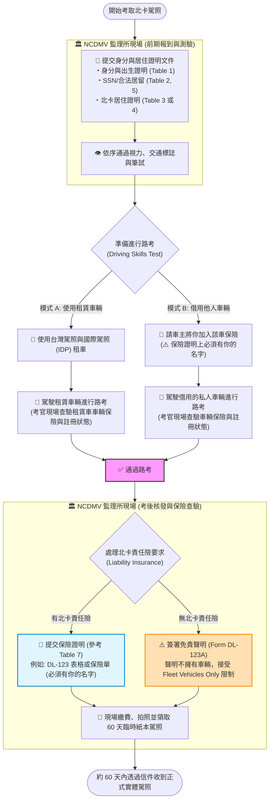

駕駛執照/State ID
=================

歡迎來到北卡，本州有全美國最獨特的駕照系統。北卡與台灣並無簽訂駕照交換協議 (Driver License Reciprocity Agreement)，因此無法直接換駕照。

迷思
----

### Q1: 我一定需要有汽車保險才能取得駕照

A1: 不用，你不需要有任何汽車保險 (auto insurance, non-owner car insurance) 也能取得駕照。

你只需要簽署 DL-123A (certification of exemption) 就可以拿到一張有 Fleet Restriction (*9-FLEET VEHICLE ONLY) 的駕照。持有 fleet restriction 限制的駕照只能駕駛租賃車，不能駕駛一般私人汽車。[^ncdmv-p23]

當你有自己的汽車保險後，可以至 NCDMV 申請解除 fleet restriction。

如果 NCDMV 現場的考官跟強硬的說一定要有保險才能拿到駕照，請篤定的跟他說不用，我簽 DL-123A 駕照有 fleet restriction 就不用保險。

### Q2: 我如果沒有自己的車，就只能拿有 fleet restriction 的駕照開租賃車

A2: 不用。

你可以購買 Non-owner car insurance，或是將自己的名子放到其他人的 auto insurance policy 底下，來符合 liability insurance requirement.

將自己的名子放在他人的 auto insurance policy 底下有幾個需要注意的狀況:

1. 可能會增加 insurance premium.

### Q2: 我一定要先拿到 Lerner Permit 才能再考 Driver License

A2: 不用。

如果 NCDMV 現場的考官跟你說你要先拿 Lerner Permit 才能再考 Driver License，請堅定的跟他說我今天就是要考 Driver License，謝謝你的關心。

### Q3: 我一定要有 Social Security Number (SSN) 才能辦理駕照

A3: 不用。

I-20 with I-94, DS2019 with I-94, I-94 都可以當作 Proof of Legal Presence Requirements.

### Q4: 我不會開車或是在北卡沒有打算開車，我就不辦駕照了

A4: 50/50。

至少辦一個 State ID/REAL ID，這樣買酒，去酒吧，搭美國國內線班機就不用帶護照證明年紀跟身份。

如何取得駕照
------------

請參考下面的流程圖：

[^ncdmv-p23]: NCDOT. (2024). North Carolina Driver Handbook, p. 23. Retrieved from [PDF](https://www.ncdot.gov/dmv/license-id/driver-licenses/new-drivers/Documents/driver-handbook.pdf).

[^ncdmv-t1]: NCDOT North Carolina Driver Handbook, Table (1), p. 16.
[^ncdmv-t1]: NCDOT North Carolina Driver Handbook, Table (1), p. 16.
